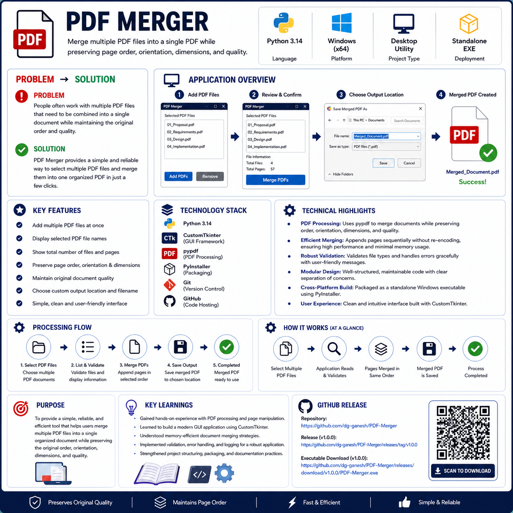

---

# PDF Merger

## Screenshots

### Screen for Adding file


---

### Display post addition


---

### Selecting Merge location


---

### Merge Completed


---

# Project Overview

PDF Merger is a Windows desktop application that combines multiple PDF documents into a single organized PDF file. The application is designed to provide a simple and intuitive interface while preserving the original page order, orientation, dimensions, and quality of every source document.

This project was developed as part of a Python desktop application portfolio and demonstrates clean software architecture using a layered design with separate UI, business logic, services, models, and utility components.

---

# Features

- Merge multiple PDF files into a single document.
- Preserve original page order.
- Preserve portrait and landscape page orientation.
- Preserve page size and document quality.
- Display selected PDF files.
- Show page count for each document.
- Show file size for each document.
- Select output file location.
- Automatic PDF extension validation.
- User-friendly success and error dialogs.
- Status bar with application progress.
- Modular architecture for maintainability.

---

# Technology Stack

| Component | Technology |
|-----------|------------|
| Language | Python 3.14 |
| GUI Framework | CustomTkinter |
| PDF Library | pypdf |
| Packaging | PyInstaller |
| IDE | Visual Studio Code |
| Version Control | Git & GitHub |

---

# Project Structure

```text
PDF-Merger/
│
├── assets/
│
├── data/
│   ├── input/
│   ├── output/
│   └── samples/
│
├── docs/
├── releases/
├── screenshots/
├── tests/
│
├── src/
│   ├── core/
│   ├── models/
│   ├── services/
│   ├── ui/
│   ├── utils/
│   └── config.py
│
├── main.py
├── requirements.txt
├── README.md
├── LICENSE
└── pyproject.toml
```

---

# Module Overview

| Module | Responsibility |
|---------|----------------|
| main.py | Application entry point |
| config.py | Application configuration and constants |
| core | Business logic |
| services | PDF processing and file operations |
| models | Data models |
| ui | User interface |
| utils | Common helper functions |

---

# How to Run

## 1. Clone the Repository

```bash
git clone https://github.com/dg-ganesh/PDF-Merger.git
```

## 2. Navigate to the Project

```bash
cd PDF-Merger
```

## 3. Install Dependencies

```bash
pip install -r requirements.txt
```

## 4. Run the Application

```bash
python main.py
```

---

# How to Build

Install PyInstaller if required.

```bash
pip install pyinstaller
```

Build the executable.

```bash
pyinstaller --onefile --windowed main.py
```

The executable will be generated inside the **dist** folder.

---

# Version

| Version | Description |
|----------|-------------|
| 1.0.0 | Initial Release |

---

# Development Workflow

This project was developed following a structured software engineering workflow.

1. Project Planning
2. Architecture Lock
3. Module Development
4. Module Verification
5. Integration
6. System Verification
7. Documentation
8. Packaging
9. GitHub Release

The project follows a layered architecture with clear separation between:

- User Interface
- Business Logic
- Services
- Models
- Utilities

---

# License

This project is licensed under the MIT License.

See the **LICENSE** file for details.